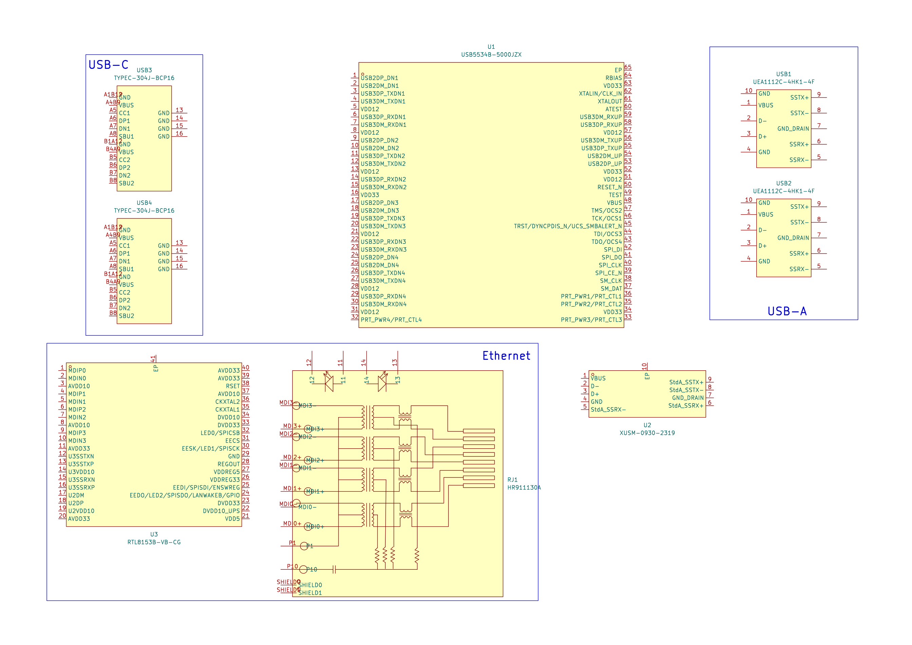

# 26/07 - Created layout
I selected the componenets that I will use and placed them in a schematic
Host (XUSM-0930-2319) -> USB5534B -> USB A (UEA1112C-4HK1-4H)
                                  -> USB C (TYPEC-304J-BCP16)
                                  -> Ethernet Controller (RTL8153B-VB-CG) -> RJ-45 Connector (HR911130A)
                                  -> Micro SD (not decided yet)
                                  -> SD (not decided yet)
### **Schematic:**

